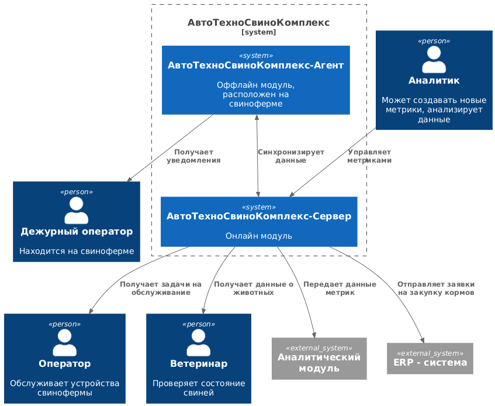
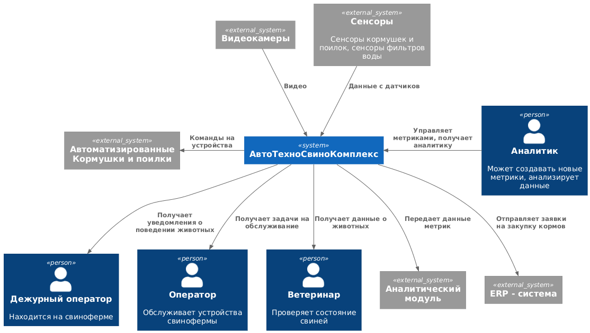

### **Название задачи:** Система АвтоТехноСвиноКомплекс (АТСК) - Автоматизированная система свинокомплекса 
### **Автор:** Марина Карманова
### **Дата:** 
### **Функциональные требования**
|**№**|**Требование**|**Комментарий**|
| :-: | :- | :- |
|F|**Функциональные (Functionality)**||
|F1|Фиксировать признаки беспокойного поведения или драк среди животных и оповещать оператора|Анализ видео|
|F2|Фиксировать признаки задавливания поросят|Анализ видео|
|F3|Управлять кормушками и поилками разных производителей|Умные датчики|
|F4|оценивать состояние животных по внешнему виду и поведению: болезнь, гибель, беспокойство и так далее|Анализ видео|
|F5|следить за состоянием систем фильтрации воды|Умные датчики|
|F6|пересчитывать поголовье|Анализ видео|
|F7|следить за запасами еды и прогнозировать расход|Внутренняя аналитика|
|F8|предоставлять базовые метрики для передачи в другие системы|аналитика|
|F9|поддерживать возможность добавления собственных метрик|аналитика|

Акторы:
- Дежурный оператор - оператор находящийся на месте мониторинга
- Оператор - обслуживание автоматических кормушек и поилок для скота, обслуживание фильтра воды
- Ветеринар
- Аналитик

Компоненты:
- Система АвтоТехноСвиноКомплекс (АТСК) - Автоматизированная система свинокомплекса

**Основные Use Cases**

|**№**|**Действующие лица или системы**|**Use Case**|**Описание**|
| :-: | :- | :- | :- |
|UC-1: Мониторинг поведения. Оповещение| Дежурный оператор, Система АТСК| Дежурный оператор получает оповещения об опасном поведении животных из Системы АТСК|Покрывает требования: F1, F2|
|UC-2: Мониторинг состояния животных| Ветеринар, Система АТСК | Ветеринар получает актуальные данные о состоянии животных из Системы АТСК |Покрывает требования: F4|
|UC-3: Управление автоматизированными кормушками и поилками|Оператор, Система АТСК| Оператор получает задачи на обслуживание автоматизированных кормушек и поилок из системы (например: открыть клапан кормушки №2, прочистить поилку №4)| Покрывает требования: F3|
|UC-4: Управление системой фильтрации воды|Оператор, Система АТСК| Оператор получает задачи на обслуживание системы фильтрации воды из Системы АТСК (например: замена фильтра №2)| Покрывает требования: F5|
|UC-5: Управление кормами|ERP-система, Система АТСК| Система АТСК анализирует данные о расходовании кормов и отправляет данные по закупке кормов в ERP-систему| Покрывает требования: F7|
|UC-6: Управление метриками|Аналитик, Система АТСК| Аналитик может настраивать метрики в Системе АТСК| Покрывает требования: F9|
|UC-7: Передача метрик|Система АТСК, ClickHouse| Система АТСК отпраляет данные метрик в общее хранилище ClickHouse| Покрывает требования: F8|

### **Нефункциональные требования**

|**№**|**Требование**|
| :-: | :- |
|R|**Надежность (Reliability)**|
|R1|работать даже в случае отсутствия интернета и при необходимости отправлять уведомления дежурному сотруднику на местах мониторинга, а после восстановления связи синхронизироваться с центральной системой|
|R2|обеспечивать достаточно высокую отказоустойчивость 99,95%|
|P|**Производительность (Performance)**|
|P1|поддерживать необходимое количество видеокамер для аналитики в реальном времени от разных производителей|
|P2|быть расширяемой, то есть иметь возможность разработать новый функционал без изменений существующего|
|P3|иметь высокую производительность — от момента возникновения нештатной ситуации, зафиксированной с помощью видеоаналитики, должно проходить не более 5 секунд до момента оповещения|
|P4|позволять системе видеоаналитики реагировать в реальном времени (миллисекунды)| 
|P5|синхронизации между агентами и центральным сервером - допускается задержка до 10 минут без учёта проблем со связью|
|+R|**+Ограничения (Restrictions)**|
|+R1|быть построена по принципу «центральный сервер — агенты» на конкретных фермах без ограничения количества таких агентов|
|+R2|Часто нейронные сети путают тень животного с самим животным — для MVP не критично|
|+R3|Проблемы с освещением — камеры должны уметь снимать и в ночное время суток|
|+R4|Трекинг животных достаточно сложен, так как особи очень похожи|
|+R5|Готовую нейросетевую модель предоставят партнёры|
|+R6|На ферме нестабильный WiFi, поэтому нужно продумать альтернативные каналы связи|
|+R7|Покрытие камерами всей площади — нужно по максимуму убрать слепые зоны либо воспользоваться камерами типа «рыбий глаз», но это снизит качество в силу выпуклости линзы|
|+R8|На каждой ферме допустимо использовать один центральный сервер и необходимый набор edge-устройств|
|+R9|иметь разделение ролей и поддерживать современные способы аутентификации и авторизации|
|+R10|иметь API для создания мобильного приложения или веб-приложения|

### **Решение**
Для автоматизации свинокомплекса будет построена отдельная система - АвтоТехноСвиноКомплекс (далее АТСК) 

Система АТСК позволяет управлять умными устройствами на ферме, такими как умные кормушки и поилки, а так же системой фильтрации воды. Это критические составляющие для автоматизированного содержания свиней и должны быть реализованы в первую очередь. В дальнейшем можно будет расширить систему и добавить в нее управление другими умными устройствами, например управлением микроклиматом в свинокомплексе или системами автоматической уборки навоза.

Система АТСК позволяет анализировать данные из автоматических устройств, и автоматически принимать решения на основании полученных данных: формировать заявки на обслуживание устройств, формировать заявки на покупку корма и отправлять их напрямую в ERP систему. 

Наблюдение за поведением и состоянием поголовья свиней осуществляется через видеонаблюдение с анализом видео в режиме реального времени через нейронную сеть (модель предоставляется партнером). Система реагирует на опасное поведение животных и незамедлительно оповещает дежурного оператора.

В силу ограничений +R4 было принято дополнительно идентифицировать свиней с помощью RFID меток. RFID сканеры расположенные у кормушек и поилок, а так же в общих местах прохода могут предоставить достоверную информацию о состоянии каждого животного.

Сотрудники фермы могут получать информацию о состоянии инфраструктуры фермы и поголовья скота в режиме реального времени. При этом должна осуществляться отправка метрик из АТСК в общий аналитический модуль компании.

Значительное вляние на архитектуру сети могут дать такие ограничения как +R6 - нестабильный Wi-Fi, при этом применяются серьезные требования к времени реакции видеонаблюдения (P3, P4). Таким образом, систему можно построить по архитектуре сервер-агенты, при этом агенты синхронизируются с сервером в случае появления интернета.

При этом система анализа видео должна быть расположена исключительно на стороне агента, т.к. к ней применяются жесткие требования к скорости реакции.

**Диаграмма контекста**

### **Альтернативы**

Албтернативный вариант может быть использован, если на фермах случаются длительные отключения интернета. В таком варианте все данные обрабатываются непосредственно на ферме (агенте), а сервер используется исключительно для аналитики.

**Диаграмма контекста**

**Недостатки, ограничения, риски**
 
 Недостатки основного подхода:
  - при долговременных потерях интернета, сотрудники не смогут получать оперативные данные

 Недостатки альтернативного подхода:
 - нет централизованных данных по ферме (кроме аналитики)
 - нет возможности управлять фермой удаленно
 
 Плюсы альтернативного подхода:
 - возможность оперативной работы сотрудников фермы при длительных отключениях интернета
   

