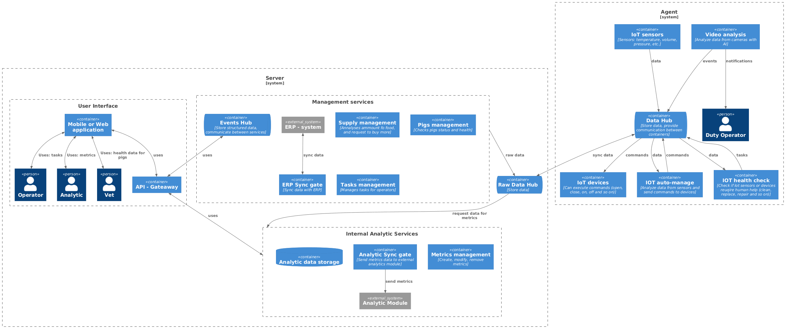
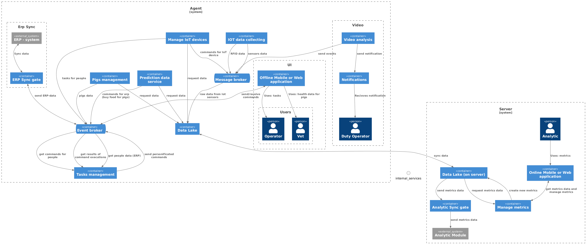

### **Название задачи:** Система АвтоТехноСвиноКомплекс (АТСК) - Автоматизированная система свинокомплекса 
### **Автор:** Марина Карманова
### **Дата:** 
### **Функциональные требования**

| **№** | **Требование**                                                                                       | **Комментарий**      |
|:-----:|:-----------------------------------------------------------------------------------------------------|:---------------------|
|   F   | **Функциональные (Functionality)**                                                                   |                      |
|  F1   | Фиксировать признаки беспокойного поведения или драк среди животных и оповещать оператора            | Анализ видео         |
|  F2   | Фиксировать признаки задавливания поросят                                                            | Анализ видео         |
|  F3   | Управлять кормушками и поилками разных производителей                                                | Умные датчики        |
|  F4   | оценивать состояние животных по внешнему виду и поведению: болезнь, гибель, беспокойство и так далее | Анализ видео         |
|  F5   | следить за состоянием систем фильтрации воды                                                         | Умные датчики        |
|  F6   | пересчитывать поголовье                                                                              | Анализ видео         |
|  F7   | следить за запасами еды и прогнозировать расход                                                      | Внутренняя аналитика |
|  F8   | предоставлять базовые метрики для передачи в другие системы                                          | Внутренняя аналитика |
|  F9   | поддерживать возможность добавления собственных метрик                                               | Внутренняя аналитика |

### **Нефункциональные требования**

| **№** | **Требование**                                                                                                                                                                                            |
|:-----:|:----------------------------------------------------------------------------------------------------------------------------------------------------------------------------------------------------------|
|   R   | **Надежность (Reliability)**                                                                                                                                                                              |
|  R1   | работать даже в случае отсутствия интернета и при необходимости отправлять уведомления дежурному сотруднику на местах мониторинга, а после восстановления связи синхронизироваться с центральной системой |
|  R2   | обеспечивать достаточно высокую отказоустойчивость 99,95%                                                                                                                                                 |
|   P   | **Производительность (Performance)**                                                                                                                                                                      |
|  P1   | поддерживать необходимое количество видеокамер для аналитики в реальном времени от разных производителей                                                                                                  |
|  P2   | быть расширяемой, то есть иметь возможность разработать новый функционал без изменений существующего                                                                                                      |
|  P3   | иметь высокую производительность — от момента возникновения нештатной ситуации, зафиксированной с помощью видеоаналитики, должно проходить не более 5 секунд до момента оповещения                        |
|  P4   | позволять системе видеоаналитики реагировать в реальном времени (миллисекунды)                                                                                                                            | 
|  P5   | синхронизации между агентами и центральным сервером - допускается задержка до 10 минут без учёта проблем со связью                                                                                        |
|  +R   | **+Ограничения (Restrictions)**                                                                                                                                                                           |
|  +R1  | быть построена по принципу «центральный сервер — агенты» на конкретных фермах без ограничения количества таких агентов                                                                                    |
|  +R2  | Часто нейронные сети путают тень животного с самим животным — для MVP не критично                                                                                                                         |
|  +R3  | Проблемы с освещением — камеры должны уметь снимать и в ночное время суток                                                                                                                                |
|  +R4  | Трекинг животных достаточно сложен, так как особи очень похожи                                                                                                                                            |
|  +R5  | Готовую нейросетевую модель предоставят партнёры                                                                                                                                                          |
|  +R6  | На ферме нестабильный WiFi, поэтому нужно продумать альтернативные каналы связи                                                                                                                           |
|  +R7  | Покрытие камерами всей площади — нужно по максимуму убрать слепые зоны либо воспользоваться камерами типа «рыбий глаз», но это снизит качество в силу выпуклости линзы                                    |
|  +R8  | На каждой ферме допустимо использовать один центральный сервер и необходимый набор edge-устройств                                                                                                         |
|  +R9  | иметь разделение ролей и поддерживать современные способы аутентификации и авторизации                                                                                                                    |
| +R10  | иметь API для создания мобильного приложения или веб-приложения                                                                                                                                           |

### **Решение**

Система будет построена на микросервисах с использованием Event-Driven Architecture.
Преимущества:
- гибкость разработки
- простое добавление нового функционала
- отказоустойчивость

Недостатки:
- сложнее в разработке

Определим так же протоколы и способы передачи данных и хранения данных:

Протокол передачи данных IoT - MQTT (EMQX broker).

- CoAP 
    - нет гарантии доставки данных
    - нет Persistent Session

- AMQP
    - поддерживает распределенные транзакции
    - поддерживает Persistent Session
    - есть гарантии доставки
  
- MQTT
    - поддерживает распределенные транзакции
    - поддерживает Persistent Session
    - есть гарантии доставки
    - более легкие сообщения по сравнению с AMQP

MQTT - хорошо подходит для коммуникации IoT. 

Для MQTT протокола существует несколько брокеров, специализирующихся на IoT системах:

**EMQX**
   - Поддерживает крупномасштабные развертывания
   - Горизонтальная масштабируемость
   - Высокая производительность и низкая задержка

Недостатки:
 - Сложный в настройке
 - Сложно эффективно управлять (требуется DevOPS)

**Mosquitto**
- Простота настройки и использования
- Легковесный, малое потребление памяти

Недостатки:
- Однопоточная архитектура
- Ограниченная масштабируемость в продакшне ( <100 тыс.)
- Нет поддержки кластеризации

**Ограниченные контексты**

***AI Video Analysis - Анализ видео с камер с помощью AI***

Видео анализируются в режиме реального времени на edge девайсе. Передача видео с камер на edge устройство через PoE.
Расположение Edge сервера для нескольких групп камер (расположенных близко территориально).
На каждом сервере могут быть установлены несколько сервисов для анализа видео.

В случае если AI идентифицирует какое-либо событие (например драка свиней), данные об этом событии отправляются в MQTT брокер. Дежурный оператор получает дополнительное оповещение (SMS)

Преимущества:
  - горизонтальное масштабирование
  - быстрое оповещение
  - возможность независимо реагировать на разные типы событие
  - поддержка различных типов камер
Ограничения:
  - передача данных с Edge сервера на MQTT брокер требует создания локальной сети (wi-fi or LAN)

***IoT Auto Management - анализ данных с сенсоров и передачи команд умным устройствам (поилкам, кормушкам)***

Решено использовать PySpark (python) для настройки взаимодействия между сенсорами и умными устройствами.
Преимущества:
- легковесный и производительный инструмент
- возможность обработки данных на лету без сохранения
- возможность передавать команды при срабатывании различных событий
- возможность передачи сценариев с сервера
- многопоточные вычисления
- возможность масштабирования через микросервисы

Недостатки:
- нужна экспертиза IT отдела
- нужно настраивать через код, нет интерфейса

Альтернативное решение:
Использовать NODE-Red
- удобный интерфейс
- возможность экспорта и импорта правил
Риски:
- однопоточные вычисления (ошибка в потоке или сложное вычисление могут привести к сбою всей системы)

***Сервисы обработки данных***

- Food Supply - расчет расхода корма и заказ покупки корма через ERP
- Pigs health monitoring - данные по свиньям - количество, здоровье, поведение и т.д.
- Task Management - задачи на обслуживание умных устройств для сотрудников фермы.

Простые сервисы, принимающие на вход данные из MQTT брокера, обработанные данные будут сохраняться в PostgreSQL.
Преимущества:
- возможность хранить как стандартные таблицы, так и NoSQL
- бесплатная лицензия
- стандарт бд в микросервисной архитектуре

Альтернативы:
А их нет, это фактически единственная БД, которая может работать одновременно и с SQL и с NoSQL данными

***Аналитика и метрики***
- Internal Analytic Services - сбор данных с IoT и анализ, возможность экспорта в другие аналитические системы

В качестве БД для необработанных данных- TimescaleDB
Преимущества:
- есть экспертиза IT отдела
- постороен на базе PostgreSQL
- aggregated views - возможность рассчитывать различные метрики на лету
- использует PSQL

Альтернативы:

InfluxDB

Преимущества:
- более производительный на большом количестве одновременных запросов (>100 000)

Недостатки:
- ~~ПУГАЮЩИЙ язык запросов, особенно если есть понимание, что такое SQL~~ нужна дополнительная экспертиза

**Диаграмма контейнеров**

### **Альтернативы**

Альтернативный вариант:
При отсутствии RFID - меток функция идентификации свиней будет передана в систему видеоанализа - дополнительный сервис Pigs Identification - он может быть запущен на тех же Edge устройствах, что и анализ событий, при этом данные об идентификации свиней пройдут через тот же канал данных, что и данные со сканеров в первом фарианте. И фактически архитектура практически не изменится. 

**Диаграмма контекста**

**Недостатки, ограничения, риски**

Недостатки альтернативного решения:
 - Сложность идентификации свиней по видео
 - возможность ошибок, что может быть критично для учета количества и здоровья свиней