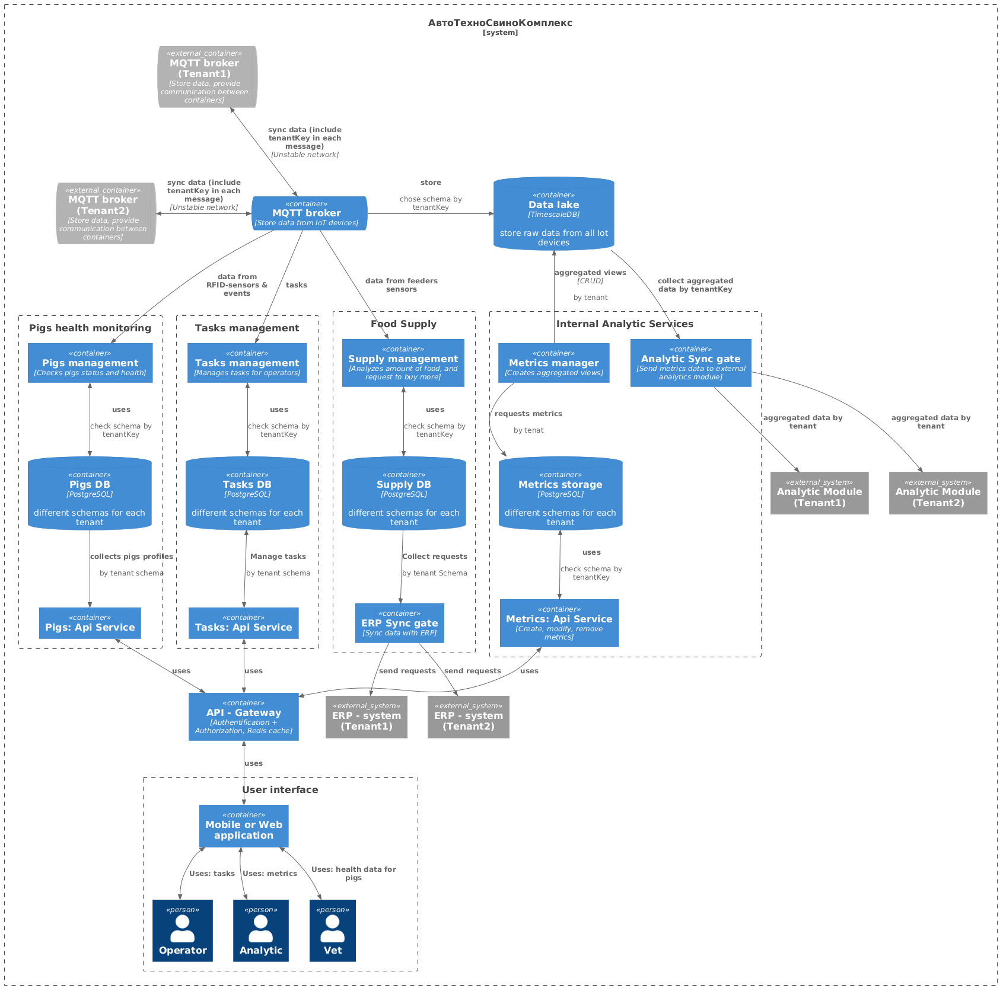
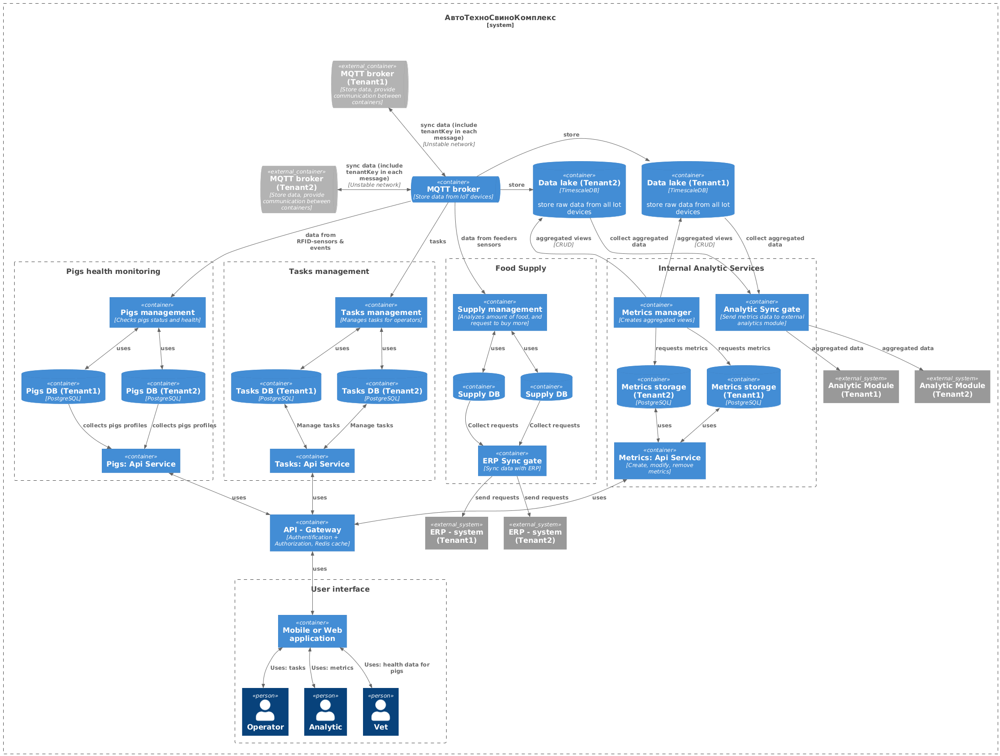
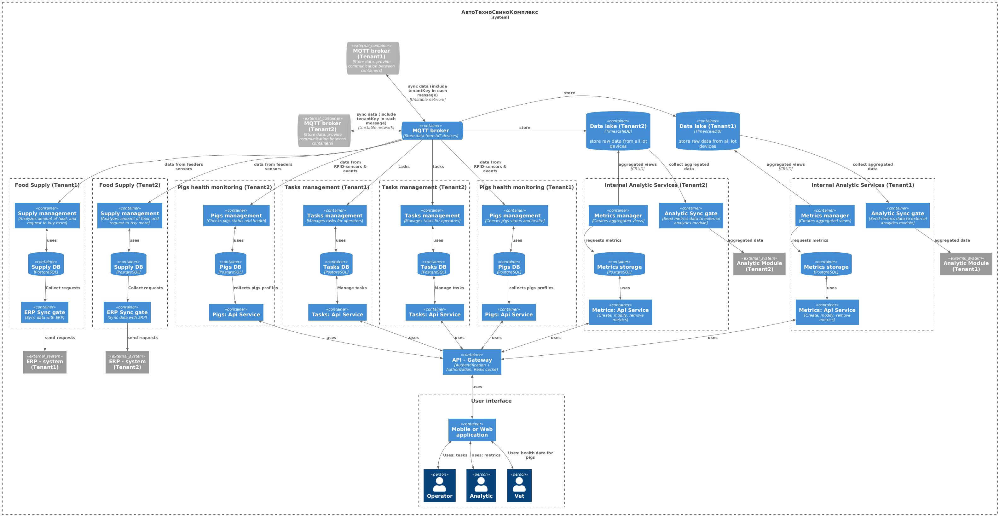
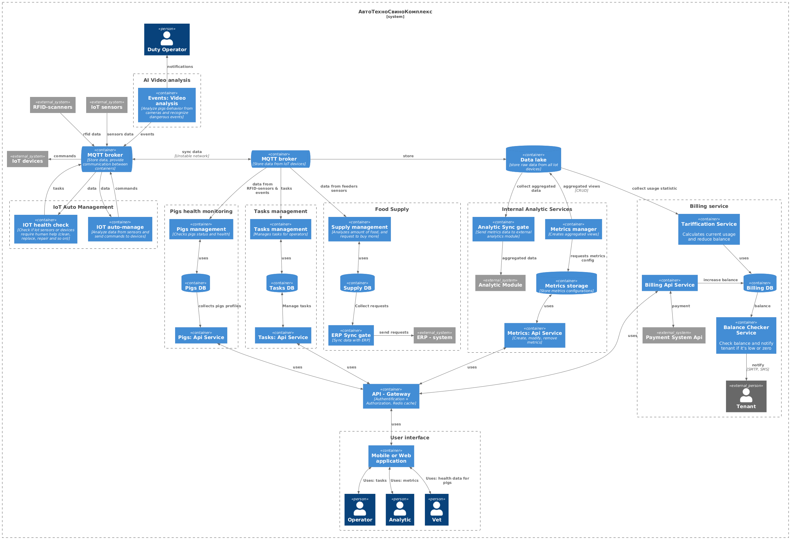
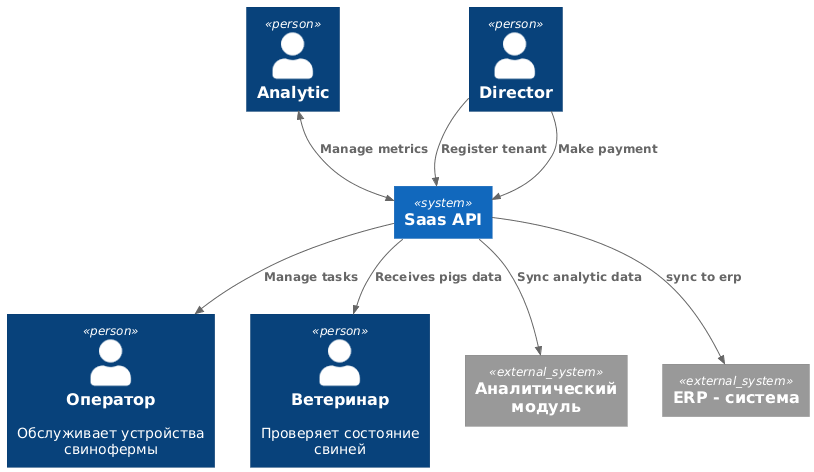

### **Название задачи:** Система АвтоТехноСвиноКомплекс (АТСК.SaaS) - Автоматизированная система свинокомплекса 
### **Автор:** Марина Карманова
### **Дата:** 
### **Функциональные требования**
 - обеспечивать полную изоляцию данных между клиентами;
 - поддерживать гибкую систему подписок с разными тарифными планами;
 - предоставлять API для интеграции с системами клиентов (варианты прорабатываются);
 - иметь панель самообслуживания для управления аккаунтом (однако пока нет специального интерфейса администратора);
 - собирать метрики использования для аналитики и биллинга.
### **Нефункциональные требования**
- масштабироваться горизонтально по мере роста числа клиентов;
### **Решение**
Изоляция на уровне схем БД:

Изоляция на уровне отдельных БД:

Изоляция на уровне инстансов:

|    Критерии выбора     |         Изоляция на уровне схем БД         |            Изоляция на уровне отдельных БД            |                Изоляция на уровне инстансов                |
|:----------------------:|:------------------------------------------:|:-----------------------------------------------------:|:----------------------------------------------------------:|
| Изолированность данных |        данные изолированы внутри БД        |                          Да                           |                             Да                             |
|       Надежность       | Низкая, при падении БД, падают все тенанты | Средне, есть падает общий сервис, падают все тенанты. | Высокая, нет общих мест между тенантами кроме MQTT брокера |
|    Масштабируемость    |                   Низкая                   |                        Высокая                        |                          Высокая                           |

Решено: использовать изоляцию на уровне инстансов

Биллинг и монетизация:

API для Saas клиентов:

**Создание документации к API**

Swagger + Swagger UI tools

Преимущество:
- автоматическая генерация при изменении кода
- OpenAPI стандарт

Недостатки:
- не работает в России

Redocly
Преимущества:
- ?

Недостатки:
- не работает в России

Rapidoc:

Преимущества:
- OpenAPI стандарт
- работает в России

Недостатки:
- нет синхронизации с кодом

Видимо будем использовать Rapidoc в силу политической ситуации в стране

To-be:

Пример интеграции:

### **Альтернативы**

***Альтернативный вариант***

